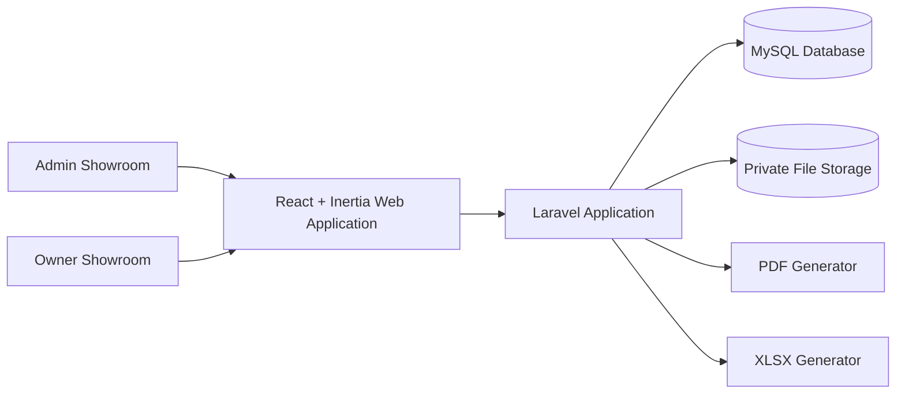
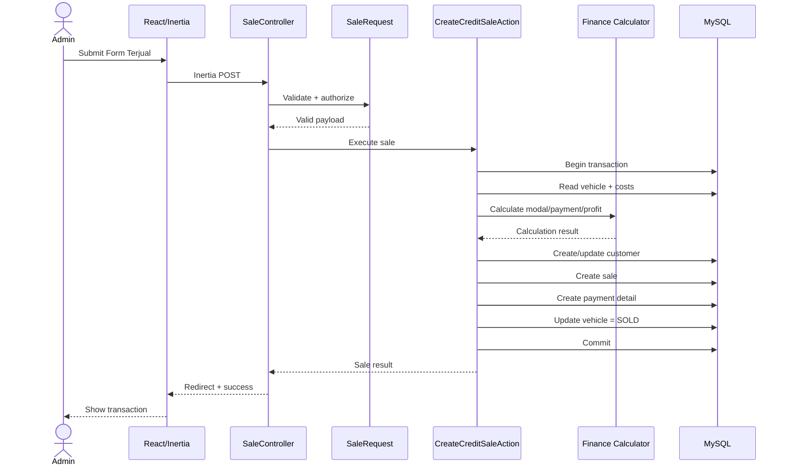
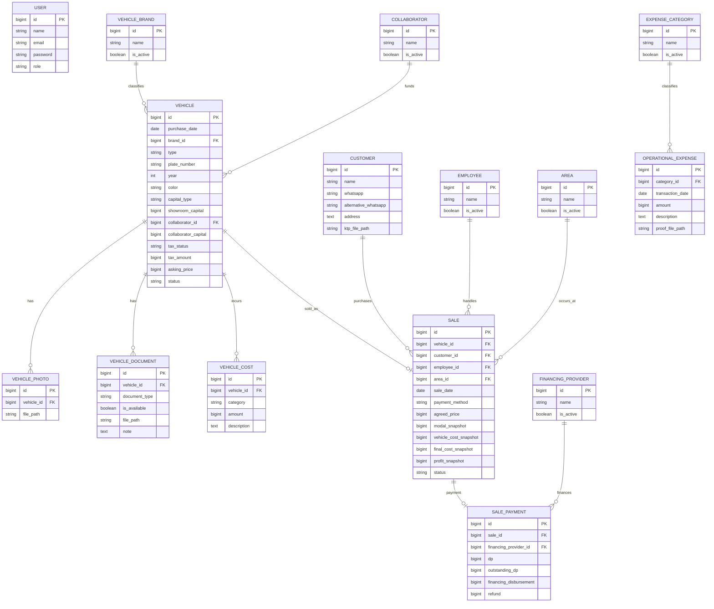
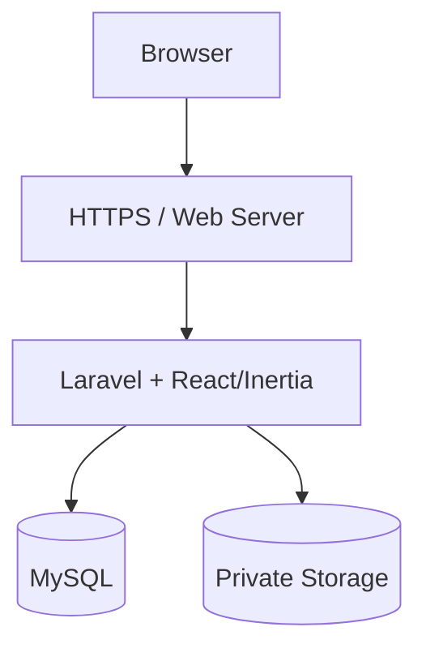

# Architecture — Mahaputra Apps

## 1. Document Information

* Status: DRAFT
* Owner: IT Product Development
* Version: 0.1
* Last updated: 2026-08-07
* Product requirements: `docs/PRD.md`
* UI specification: `docs/UI_SPEC.md`

---

# 2. System Overview

**Mahaputra Apps** adalah web application internal untuk mengelola aktivitas operasional penjualan mobil bekas Mahaputra Group.

Sistem mencakup pengelolaan kendaraan sejak masuk showroom, pencatatan sumber modal, kolaborator, biaya kendaraan, dokumen kendaraan, penjualan cash/kredit, data pelanggan, biaya operasional, dashboard, dan reporting.

Pengguna utama sistem:

* Admin Showroom
* Owner Showroom

Arsitektur MVP menggunakan pola **Modular Monolith**, dengan:

* Laravel sebagai backend/application framework.
* React sebagai presentation layer.
* Inertia.js sebagai penghubung Laravel dan React.
* MySQL sebagai relational database.
* Laravel session authentication untuk autentikasi internal.

Frontend dan backend berada dalam satu repository dan satu deployment unit.

## 2.1 System context



Tidak ada layanan eksternal yang wajib untuk MVP.

## 2.2 In scope

* Authentication.
* Role-based authorization.
* Dashboard.
* Vehicle management.
* Vehicle document management.
* Vehicle cost management.
* UMUM/KHUSUS capital management.
* Collaborator management.
* Customer management.
* CASH sales.
* CREDIT sales.
* Operational expenses.
* Employee/PIC data.
* Master data.
* Reporting.
* PDF generation.
* XLSX generation.
* Private file management.

## 2.3 Out of scope

* Public marketplace.
* Mobile native application.
* Microservices.
* Separate React deployment.
* Public REST API.
* Payment gateway.
* Bank integration.
* Leasing API integration.
* WhatsApp integration.
* Full accounting system.
* Multi-collaborator.
* Offline-first application.
* Complex approval workflow.
* Multi-tenant SaaS architecture.

---

# 3. Architecture Goals and Principles

## Architecture Principles

### AP-01 — Simple Before Distributed

Mahaputra Apps menggunakan **Modular Monolith** untuk MVP.

Microservices tidak digunakan selama kebutuhan scale atau organizational boundary belum membutuhkannya.

### AP-02 — Server Is Source of Truth

Semua business rule utama harus divalidasi dan dihitung kembali oleh Laravel.

React tidak menjadi sumber kebenaran untuk:

* Modal Awal.
* Modal Akhir.
* Harga Kredit.
* Laba Kendaraan.
* Status kendaraan.
* Authorization.

Frontend hanya boleh melakukan kalkulasi preview untuk UX.

### AP-03 — Financial Calculation Must Be Deterministic

Perhitungan finansial tidak boleh menggunakan floating-point.

Nominal Rupiah disimpan menggunakan integer.

Contoh:

```text
Rp150.000.000

disimpan sebagai:

150000000
```

### AP-04 — Financial Writes Must Be Transactional

Operasi yang mengubah beberapa data finansial sekaligus harus menggunakan database transaction.

Contoh:

* Membuat transaksi penjualan.
* Mengubah kendaraan menjadi SOLD.
* Membuat detail pembayaran.
* Menghitung snapshot modal/laba.

Semua harus berhasil atau semuanya dibatalkan.

### AP-05 — Authorization Is Server-Enforced

Menyembunyikan tombol di React tidak dianggap sebagai authorization.

Laravel Policy/Middleware tetap wajib menentukan apakah sebuah aksi diperbolehkan.

### AP-06 — Sensitive Files Are Private

File berikut tidak boleh disimpan sebagai public asset:

* KTP pelanggan.
* STNK.
* BPKB.
* Bukti transaksi internal.

Akses file harus melalui authorization.

### AP-07 — Historical Data Must Remain Stable

Perubahan master data tidak boleh merusak transaksi historis.

Master data yang sudah digunakan lebih baik dinonaktifkan daripada dihapus secara permanen.

### AP-08 — Business Logic Must Not Live in Controllers

Controller menangani HTTP/request orchestration.

Business rule utama ditempatkan pada Action/Service/Domain layer.

### AP-09 — Reuse Business Logic

Business rule yang sama tidak boleh ditulis ulang di:

* Controller.
* Export.
* Dashboard.
* React.

Perhitungan harus menggunakan service/action yang sama.

### AP-10 — Optimize for Maintainability

Struktur kode harus mudah dipahami oleh developer baru dan AI coding tools seperti Codex.

Hindari abstraction yang belum diperlukan.

---

## Quality attribute priorities

| Attribute       | Priority | Target/meaning                                                  |
| --------------- | -------- | --------------------------------------------------------------- |
| Security        | High     | Data pelanggan dan finansial hanya dapat diakses role berwenang |
| Data Integrity  | High     | Perhitungan dan transaksi finansial harus konsisten             |
| Maintainability | High     | Modular, business logic terpisah dari UI                        |
| Reliability     | High     | Tidak terjadi partial transaction                               |
| Performance     | Medium   | Halaman umum ≤ 3 detik pada kondisi normal                      |
| Scalability     | Medium   | Mendukung peningkatan data tanpa perubahan arsitektur besar     |
| Availability    | Medium   | Memadai untuk internal showroom                                 |
| Accessibility   | Medium   | Form dan dashboard mudah digunakan                              |

---

# 4. Technology Stack

Versi exact harus dikunci pada `composer.lock` dan `package-lock.json`/lockfile project ketika development dimulai.

| Area          | Technology                               | Version                          | Rationale                                                        | Constraints                    |
| ------------- | ---------------------------------------- | -------------------------------- | ---------------------------------------------------------------- | ------------------------------ |
| Backend       | Laravel                                  | Stable supported version         | Framework utama, authentication, ORM, validation, queue, storage | Single backend application     |
| Runtime       | PHP                                      | Compatible with selected Laravel | Runtime Laravel                                                  | Mengikuti requirement Laravel  |
| Frontend      | React                                    | Stable supported version         | Component-based UI                                               | Digunakan melalui Inertia      |
| Bridge        | Inertia.js                               | Compatible stable version        | Menghubungkan Laravel dan React tanpa API terpisah               | Web application only           |
| CSS           | Tailwind CSS                             | Stable supported version         | Cepat untuk dashboard responsive                                 | Harus konsisten dengan UI_SPEC |
| Database      | MySQL                                    | 8+ proposed                      | Relational data cocok untuk transaksi                            | Primary relational datastore   |
| ORM           | Laravel Eloquent                         | Laravel bundled                  | Relasi dan query management                                      | Hindari N+1                    |
| Auth          | Laravel Session Auth                     | Laravel bundled                  | Cocok untuk internal web application                             | Same-origin web app            |
| File Storage  | Laravel Storage                          | —                                | Abstraction local/S3-compatible                                  | Sensitive file harus private   |
| PDF           | Laravel-compatible PDF library           | TBD                              | Invoice dan internal report                                      | Dipilih saat implementation    |
| Excel         | Laravel Excel-compatible library         | TBD                              | XLSX report                                                      | Dipilih saat implementation    |
| Cache         | Database/File initially                  | —                                | Tidak membutuhkan Redis untuk MVP                                | Upgrade jika diperlukan        |
| Queue         | Laravel Queue, database driver initially | —                                | Background processing jika diperlukan                            | Redis future                   |
| Backend Test  | Pest/PHPUnit                             | Compatible                       | Unit & feature testing                                           | CI required                    |
| Frontend Test | Vitest + React Testing Library           | Compatible                       | Component testing                                                | Critical components            |
| E2E           | Playwright                               | Compatible                       | Critical user journey                                            | Pre-release                    |

---

# 5. Repository Structure

Proposed repository structure:

```text
mahaputra-app/
│
├── app/
│   ├── Actions/
│   │   ├── Vehicles/
│   │   ├── Sales/
│   │   ├── Operations/
│   │   └── Reports/
│   │
│   ├── Services/
│   │   ├── Vehicle/
│   │   ├── Sales/
│   │   ├── Finance/
│   │   └── Reports/
│   │
│   ├── Enums/
│   ├── Models/
│   ├── Policies/
│   ├── Support/
│   │
│   └── Http/
│       ├── Controllers/
│       ├── Middleware/
│       └── Requests/
│
├── bootstrap/
│
├── config/
│
├── database/
│   ├── factories/
│   ├── migrations/
│   └── seeders/
│
├── resources/
│   └── js/
│       ├── Components/
│       ├── Features/
│       │   ├── Dashboard/
│       │   ├── Vehicles/
│       │   ├── Sales/
│       │   ├── Operations/
│       │   ├── Reports/
│       │   └── MasterData/
│       │
│       ├── Layouts/
│       ├── Pages/
│       ├── Hooks/
│       ├── Lib/
│       └── Types/
│
├── routes/
│   ├── web.php
│   └── console.php
│
├── storage/
│
├── tests/
│   ├── Feature/
│   └── Unit/
│
├── docs/
│   ├── PRD.md
│   ├── ARCHITECTURE.md
│   ├── UI_SPEC.md
│   └── adr/
│
├── AGENTS.md
├── composer.json
├── package.json
└── README.md
```

## Dependency direction

```text
React UI
   ↓
HTTP Controller / Form Request
   ↓
Action / Application Service
   ↓
Domain / Business Rules
   ↓
Model / Repository / Infrastructure
   ↓
Database / File Storage
```

Rules:

```text
Presentation → Application → Domain

Infrastructure implements requirements needed by Application/Domain.

Domain/business calculations must not depend on React.

React must not directly access database.

Controller must not contain core financial calculations.
```

---

# 6. Application Layers

## 6.1 Presentation Layer

### Backend presentation

Components:

* Routes.
* Controllers.
* Form Requests.
* Inertia Responses.

Responsibilities:

* Receive request.
* Request validation.
* Authorization invocation.
* Call Action/Service.
* Return Inertia response or redirect.

Must not contain:

* Modal calculations.
* Profit calculations.
* Complex state transition.
* Direct financial business logic.

### Frontend presentation

Components:

* React Pages.
* Components.
* Layouts.
* Forms.
* Tables.
* Charts.

Responsibilities:

* Render UI.
* Client-side UX validation.
* Loading state.
* Error state.
* User interaction.
* Form submission.

Business validation tetap dilakukan ulang oleh Laravel.

---

## 6.2 Application / Use-case Layer

Primary structure:

```text
Actions
Services
```

Example:

```text
CreateVehicleAction
UpdateVehicleAction
AddVehicleCostAction
CreateCashSaleAction
CreateCreditSaleAction
UpdateSaleAction
CreateOperationalExpenseAction
ExportSalesReportAction
```

Responsibilities:

* Orchestrate use cases.
* Start transaction.
* Call business calculation.
* Update related entities.
* Produce result.

Example:

```text
CreateCreditSaleAction

1. Validate vehicle availability.
2. Calculate credit payment total.
3. Calculate modal snapshot.
4. Calculate profit.
5. Create customer/sale/payment.
6. Mark vehicle SOLD.
7. Commit transaction.
```

---

# 6.3 Domain Layer

Responsibilities:

* Financial calculation.
* Capital rules.
* Payment rules.
* Status transitions.
* Business invariants.

Examples:

```text
VehicleCapitalCalculator
VehicleFinalCostCalculator
SaleProfitCalculator
CreditSaleCalculator
VehicleStatusTransition
```

Important invariants:

### UMUM

```text
collaborator_id != null
collaborator_capital > 0
```

```text
Modal Awal =
Modal Showroom + Modal Kolaborator
```

### KHUSUS

```text
collaborator_id = null
collaborator_capital = 0
```

```text
Modal Awal =
Modal Showroom
```

### Modal Akhir

```text
Modal Akhir =
Modal Awal + Total Biaya Kendaraan
```

### CASH

```text
DP Terutang = 0
Financing Provider = null
Financing Disbursement = 0
Refund = 0
```

```text
Laba =
Harga Terjual - Modal Akhir
```

### CREDIT

```text
Total Payment =
DP
+ DP Terutang
+ Financing Disbursement
+ Refund
```

```text
Laba =
Total Payment - Modal Akhir
```

### Vehicle Sale

Satu kendaraan hanya boleh memiliki satu transaksi penjualan final yang aktif.

---

# 6.4 Infrastructure / Data Layer

Responsibilities:

* MySQL persistence.
* Eloquent models.
* File storage.
* PDF generation.
* Excel generation.
* Queue.
* Logging.

Infrastructure-specific implementation tidak boleh menjadi tempat utama business rules.

---

# 7. Module Architecture

| Module            | Responsibility          | Owns data            | Depends on                            |
| ----------------- | ----------------------- | -------------------- | ------------------------------------- |
| Authentication    | Login dan session       | users                | —                                     |
| Authorization     | Role/access control     | users/roles          | Authentication                        |
| Dashboard         | Business summary        | Read models/queries  | Vehicles, Sales, Operations           |
| Vehicles          | Kendaraan dan modal     | vehicles             | Master Data, Collaborators            |
| Vehicle Costs     | Biaya kendaraan         | vehicle_costs        | Vehicles                              |
| Vehicle Documents | STNK/BPKB/foto          | vehicle_documents    | Vehicles                              |
| Collaborators     | Pemilik modal eksternal | collaborators        | —                                     |
| Customers         | Pembeli                 | customers            | —                                     |
| Sales             | Transaksi kendaraan     | sales                | Vehicles, Customers, Employees, Areas |
| Payments          | CASH/KREDIT             | sale_payments        | Sales, Financing                      |
| Operations        | Biaya operasional       | operational_expenses | Master Data                           |
| Employees         | PIC                     | employees            | —                                     |
| Master Data       | Dropdown/config data    | master tables        | —                                     |
| Reports           | PDF/XLSX/report queries | —                    | Vehicles, Sales, Operations           |
| Files             | Private attachments     | file references      | Multiple modules                      |

## Cross-module rules

* Dashboard hanya membaca data dari module lain.
* Reports tidak boleh mengubah transaksi.
* Sales boleh membaca Vehicle tetapi perubahan status harus melalui Vehicle/Sale Action.
* Master Data tidak boleh hard-delete value yang sudah digunakan.
* React tidak melakukan query langsung ke module/database.
* Cross-module write dilakukan melalui Action/Service.
* Financial calculations menggunakan calculator/service bersama.

---

# 8. Request and Data Flow

## Use case: Menjual Kendaraan Secara Kredit



## Flow rules

* Server performs authoritative validation.
* Authorization dilakukan sebelum protected data access.
* Financial multi-write menggunakan transaction.
* Vehicle dikunci/divalidasi ulang sebelum dijual.
* Status SOLD dicek sebelum transaksi dibuat.
* Duplicate submission harus dicegah.

---

# 9. API and Interface Conventions

## MVP interface style

```text
Laravel Web Routes + Inertia.js
```

Tidak diperlukan REST API terpisah untuk React pada MVP.

React berinteraksi melalui:

```text
GET    Inertia Page
POST   Laravel Action
PUT    Laravel Action
PATCH  Laravel Action
DELETE Laravel Action apabila diizinkan
```

## Future API

Jika dibutuhkan:

```text
/api/v1/
```

dapat ditambahkan untuk:

* Mobile application.
* External integration.
* Leasing integration.

Application/domain logic tetap digunakan kembali.

## Naming

### PHP

```text
camelCase
PascalCase class
```

### Database

```text
snake_case
```

### React/TypeScript

```text
camelCase variable
PascalCase component
```

## Date/time

Transport:

```text
ISO 8601
```

Database timestamp:

```text
UTC
```

UI:

```text
Asia/Makassar (WITA)
```

Tanggal bisnis seperti `purchase_date` disimpan sebagai `DATE`.

## Money

Gunakan integer Rupiah:

```text
BIGINT UNSIGNED
```

Contoh:

```text
150000000 = Rp150.000.000
```

Tidak menggunakan:

```text
FLOAT
DOUBLE
```

untuk nilai finansial.

## Pagination

Default:

```text
25 records/page
```

Options:

```text
25
50
100
```

## Filtering

Contoh:

```text
?search=avanza
&status=READY
&area=bone
&date_from=2026-08-01
&date_to=2026-08-31
```

## Error response

Untuk Inertia, validation menggunakan Laravel validation error bag.

Jika endpoint JSON digunakan:

```json
{
  "message": "Data tidak dapat diproses.",
  "code": "SALE_VALIDATION_FAILED",
  "errors": {
    "selling_price": [
      "Harga terjual wajib diisi."
    ]
  }
}
```

---

# 10. Authentication and Authorization

## Authentication

Method:

```text
Laravel Session Authentication
```

Login:

```text
username/email + password
```

Session cookie:

* HttpOnly.
* Secure pada production.
* SameSite sesuai deployment.
* Session regenerate setelah login.

MFA:

```text
Not required for MVP
```

Future consideration untuk Owner.

## Authorization

Model:

```text
RBAC + Laravel Policies
```

Roles MVP:

```text
ADMIN
OWNER
```

### Admin

Dapat:

* Create kendaraan.
* Edit kendaraan.
* Create penjualan.
* Edit penjualan.
* Input biaya.
* Kelola operasional.
* Kelola master data.
* Generate laporan.

### Owner

Read-only terhadap data operasional.

Dapat:

* View dashboard.
* View reports.
* View transaction summaries.
* Export PDF/XLSX.

## Enforcement

Authorization harus dilakukan pada:

1. Middleware.
2. Controller.
3. Laravel Policy.
4. File download endpoint.

Default:

```text
deny unless explicitly allowed
```

---

# 10.1 Data Isolation

Mahaputra Apps bukan multi-tenant SaaS pada MVP.

Semua data merupakan data Mahaputra Group.

Data isolation dilakukan berdasarkan:

```text
Role
```

Future:

Jika akses Admin dibatasi berdasarkan area, architecture dapat ditambahkan:

```text
users.area_id
```

atau assignment table.

Requirement tersebut masih TBD.

---

# 11. Data Architecture

## 11.1 Core Entities

| Entity             | Purpose                   | Key relationships            | Important invariants               |
| ------------------ | ------------------------- | ---------------------------- | ---------------------------------- |
| User               | Akun aplikasi             | role                         | User aktif untuk login             |
| Employee           | PIC transaksi             | has many Sales               | Employee lama tidak hard delete    |
| Area               | Area transaksi            | has many Sales               | Master data                        |
| Collaborator       | Pemilik modal             | has many Vehicles            | Max 1 per Vehicle                  |
| Vehicle            | Kendaraan showroom        | costs, documents, sale       | Plate unique untuk kendaraan aktif |
| VehiclePhoto       | Foto kendaraan            | belongs Vehicle              | File private/internal              |
| VehicleDocument    | STNK/BPKB                 | belongs Vehicle              | Type STNK/BPKB                     |
| VehicleCost        | Biaya kendaraan           | belongs Vehicle              | Amount ≥ 0                         |
| Customer           | Pembeli                   | has many Sales               | Data personal                      |
| Sale               | Transaksi kendaraan       | Vehicle, Customer, PIC, Area | One final Sale per Vehicle         |
| SalePayment        | Detail payment            | belongs Sale                 | CASH/CREDIT rules                  |
| OperationalExpense | Pengeluaran perusahaan    | category                     | Amount ≥ 0                         |
| VehicleBrand       | Merk                      | has many Vehicles            | Master                             |
| FinancingProvider  | Leasing                   | has many Sales               | Required for CREDIT                |
| ExpenseCategory    | Jenis operasional         | has many expenses            | Master                             |
| AuditMetadata      | Minimum actor information | multiple entities            | created_by/updated_by              |

---

# 11.2 ERD



---

# 11.3 Financial Snapshot Strategy

Ketika kendaraan dijual, data finansial penting disimpan sebagai snapshot pada transaksi.

Contoh:

```text
modal_snapshot
vehicle_cost_snapshot
final_cost_snapshot
profit_snapshot
```

Tujuan:

Perubahan master data atau informasi kendaraan di masa depan tidak otomatis mengubah laporan transaksi historis.

Contoh:

Saat transaksi:

```text
Modal Awal    Rp100 juta
Biaya         Rp10 juta
Modal Akhir   Rp110 juta
Harga Jual    Rp130 juta
Laba          Rp20 juta
```

Nilai tersebut tersimpan pada Sale.

Jika kemudian nama kategori biaya berubah, laba historis tetap:

```text
Rp20 juta
```

Jika Admin memang melakukan koreksi transaksi finansial, recalculation harus dilakukan melalui use-case khusus.

---

# 11.4 Data Ownership and Tenancy

Tenant:

```text
Mahaputra Group
```

Tidak menggunakan tenant key pada MVP.

Jika aplikasi berkembang menjadi multi-showroom organization atau SaaS, tenancy harus dibuat melalui migration architecture tersendiri dan ADR baru.

---

# 11.5 Transactions and Consistency

Database transaction wajib pada:

### Create sale

```text
Create customer
Create sale
Create sale payment
Update vehicle status
Create financial snapshot
```

### Update sale

```text
Update sale
Update payment
Recalculate profit
Update snapshot
```

### Other multi-write financial flows

Gunakan:

```php
DB::transaction(...)
```

## Concurrency strategy

Saat membuat penjualan:

1. Load vehicle.
2. Pastikan status bukan SOLD.
3. Gunakan transactional validation.
4. Database unique constraint mencegah duplicate final sale.

Proposed constraint:

```text
One vehicle → one final sale
```

---

# 11.6 Duplicate Prevention

UI:

```text
Disable submit while request processing
```

Server:

* Validate vehicle status.
* Unique constraint.
* Transaction.
* Inertia processing state.

Tidak mengandalkan frontend saja.

---

# 11.7 Migration Strategy

* Never edit deployed migration.
* Setiap schema change membuat migration baru.
* Foreign key harus explicit.
* Index dibuat berdasarkan query nyata.
* Migration sebisa mungkin reversible.
* Backup dilakukan sebelum production migration berisiko tinggi.

Backfill:

* Gunakan command/job khusus.
* Hindari update data besar langsung di migration jika volume sudah besar.

Zero-downtime:

```text
Tidak menjadi kebutuhan utama MVP.
```

Tetapi destructive migration di production harus dihindari.

---

# 11.8 Audit and Retention

Minimum audit fields:

```text
created_at
updated_at
created_by
updated_by
```

Untuk entity finansial:

* Sale.
* Vehicle cost.
* Operational expense.

Full before/after audit log:

```text
Future / Recommended
```

Retention:

Data transaksi tidak dihapus otomatis.

Financial records sebaiknya menggunakan:

```text
archive / soft delete
```

daripada hard delete.

---

# 12. File and Object Storage

## Files

Sistem menyimpan:

* Foto kendaraan.
* KTP.
* STNK.
* BPKB.
* Bukti operasional.

## Storage

Development:

```text
Laravel private local storage
```

Production recommended:

```text
Private object storage / S3-compatible storage
```

atau private server storage jika deployment masih sederhana.

## Storage classification

### Public/Internal Visual

Foto kendaraan dapat ditampilkan kepada authenticated users.

### Sensitive

* KTP.
* STNK.
* BPKB.
* Bukti finansial.

Harus private.

## Access

Tidak boleh:

```text
https://domain.com/storage/ktp/123.jpg
```

yang dapat diakses tanpa authentication.

Akses dilakukan:

```text
User
 ↓
Authorized Laravel Route
 ↓
Policy
 ↓
Private Storage
```

## Allowed formats

Proposed:

### Images

```text
JPEG
PNG
WEBP
```

### Documents

Jika diperlukan:

```text
PDF
```

Exact max size:

```text
TBD
```

Recommended initial:

```text
5 MB/image
10 MB/document
```

perlu dikonfirmasi sebelum implementation final.

## Naming

Gunakan generated identifier.

Contoh:

```text
vehicles/{vehicle_uuid}/photos/{uuid}.webp

vehicles/{vehicle_uuid}/documents/stnk/{uuid}.jpg

customers/{customer_uuid}/ktp/{uuid}.jpg
```

Jangan menggunakan nama pelanggan sebagai nama path public.

MVP implementation note:

```text
vehicles/{vehicle_id}/photos/{generated_filename}
```

Foto kendaraan tetap disimpan pada Laravel private local storage dan hanya
ditampilkan lewat authenticated Laravel route. Konversi otomatis ke WebP dapat
ditambahkan setelah kebutuhan compression final dikonfirmasi.

---

# 13. External Integrations

Tidak terdapat external integration wajib pada MVP.

| Integration | Purpose | Auth | Timeout/retry | Failure behavior |
| ----------- | ------- | ---- | ------------- | ---------------- |
| None        | —       | —    | —             | —                |

Future possibilities:

* WhatsApp.
* Financing provider.
* Cloud storage.
* Accounting system.

## Integration rules

Jika integration ditambahkan:

* Client dibungkus dalam dedicated Service/Adapter.
* Timeout explicit.
* Retry terbatas.
* Secret hanya melalui environment variable.
* Jangan log credential/token.
* External failure tidak boleh merusak database transaction internal.

---

# 14. Caching and Queues

## Caching

Untuk MVP, caching kompleks belum diperlukan.

Candidate cache:

* Dashboard aggregate.
* Master data yang jarang berubah.

Never cache secara shared/public:

* KTP.
* STNK.
* BPKB.
* Data sensitif customer.
* Form financial draft.

Cache invalidation dilakukan setelah data terkait berubah.

## Background Jobs

MVP dapat memulai tanpa queue untuk proses kecil.

Laravel Queue digunakan apabila:

* PDF besar.
* XLSX besar.
* Image compression.
* Reporting mulai lambat.

Initial driver:

```text
database
```

Future:

```text
Redis
```

Jobs harus idempotent bila memungkinkan.

---

# 15. Error Handling and Logging

## Error categories

### Validation

Contoh:

```text
VALIDATION_ERROR
```

Ditampilkan pada field.

### Domain

Contoh:

```text
VEHICLE_ALREADY_SOLD
INVALID_CAPITAL_TYPE
CREDIT_PAYMENT_MISMATCH
```

### Authorization

```text
FORBIDDEN
```

### Unexpected

```text
INTERNAL_ERROR
```

## Logging

### INFO

* Login.
* Sale created.
* Export generated.
* Vehicle status changed.

### WARN

* Repeated failed login.
* Business rule rejection.
* File upload validation failure.

### ERROR

* Database error.
* Export crash.
* Storage failure.
* Unexpected exception.

## Must redact

* Password.
* Session token.
* KTP image.
* STNK/BPKB content.
* Authentication cookies.
* Other secret/environment values.

User tidak boleh melihat stack trace di production.

---

# 16. Security Architecture

## Primary threats

* Unauthorized financial data access.
* Customer KTP exposure.
* STNK/BPKB exposure.
* Manipulation of financial values.
* Duplicate sale submission.
* Unauthorized edit of SOLD transactions.
* Malicious file upload.
* Stolen session.
* SQL injection/XSS/CSRF.

## Input Validation

Gunakan Laravel Form Request.

Validation dilakukan untuk:

* Type.
* Required fields.
* Numeric range.
* File type.
* File size.
* Relation existence.
* Business conditions.

## SQL Injection

Gunakan:

* Eloquent.
* Query Builder.
* Parameter binding.

Raw SQL harus diminimalkan.

## XSS

React melakukan escaping secara default.

`dangerouslySetInnerHTML` dilarang tanpa alasan khusus dan sanitization.

## CSRF

Laravel CSRF protection wajib untuk state-changing web requests.

## CORS

Karena Laravel dan React melalui Inertia berada dalam origin yang sama:

```text
Tidak membutuhkan permissive CORS.
```

## Rate Limiting

Minimal:

* Login endpoint.
* Password reset jika tersedia.

## Secret Management

Semua secret melalui:

```text
.env
```

`.env` tidak masuk Git.

`.env.example` tidak berisi secret asli.

## Security Headers

Production recommended:

* HTTPS.
* HSTS.
* X-Content-Type-Options.
* Referrer-Policy.
* Frame protection.
* Content-Security-Policy setelah testing.

## File Security

* MIME validation.
* Extension validation.
* Random filename.
* Private storage.
* Authorized access.

---

# 17. Performance and Scalability

## Initial profile

Mahaputra Apps merupakan aplikasi internal.

Expected concurrency:

```text
Low
```

Proposed assumption:

```text
< 25 concurrent users
```

Harus divalidasi jika jumlah pengguna berkembang.

## Response targets

Normal page:

```text
≤ 3 seconds
```

Normal form submission:

```text
≤ 2 seconds
```

Search/filter:

```text
≤ 2 seconds
```

tidak termasuk export besar.

## Index strategy

Candidate indexes:

```text
vehicles.plate_number
vehicles.status
vehicles.purchase_date

sales.vehicle_id
sales.sale_date
sales.area_id
sales.employee_id
sales.payment_method

operational_expenses.transaction_date
operational_expenses.category_id
```

Compound indexes hanya dibuat berdasarkan query nyata.

## Pagination

Maximum normal page:

```text
100 rows
```

Laporan data besar menggunakan export atau background job.

## Known hot paths

* Dashboard aggregates.
* Vehicle listing.
* Sales report.
* Date filtering.
* XLSX export.

## Scaling path

Tahapan peningkatan:

```text
1. Query optimization
2. Index optimization
3. Cache dashboard
4. Queue heavy jobs
5. Redis
6. Separate read/report workload
```

Microservices bukan langkah pertama.

---

# 18. Testing Strategy

| Test type    | Scope                       | Tool         | Required for          |
| ------------ | --------------------------- | ------------ | --------------------- |
| Unit         | Finance/domain calculations | Pest/PHPUnit | Semua perubahan rumus |
| Feature      | Request + Auth + DB         | Pest/PHPUnit | CRUD dan transaksi    |
| UI/component | React form/components       | Vitest + RTL | Critical UI           |
| End-to-end   | Critical business flow      | Playwright   | Pre-release           |

## Required Unit Tests

### UMUM

```text
Modal Showroom + Modal Kolaborator
```

### KHUSUS

```text
Modal Showroom only
```

### Modal Akhir

```text
Modal Awal + Service/Costs
```

### CASH

```text
Harga Terjual - Modal Akhir
```

### CREDIT

```text
DP
+ DP Terutang
+ Cair Pembiayaan
+ Refund
- Modal Akhir
```

## Required Feature Tests

* Admin can create vehicle.
* Owner cannot create vehicle.
* UMUM requires collaborator.
* KHUSUS rejects collaborator capital.
* CASH rejects credit fields.
* CREDIT requires financing provider.
* Sold vehicle cannot be sold twice.
* Unauthorized user cannot access private KTP.
* Owner cannot edit sale.
* Financial multi-write rollback when one operation fails.

## Required E2E

### E2E-01

```text
Login
→ Tambah Kendaraan
→ Tambah Biaya
→ READY
→ Terjual CASH
→ Invoice
→ Report
```

### E2E-02

```text
Login
→ Tambah Kendaraan UMUM
→ Tambah Biaya
→ Terjual CREDIT
→ Calculate Profit
→ Report
```

### E2E-03

```text
Owner Login
→ Dashboard
→ Filter Report
→ Export
```

---

# 19. Deployment Architecture

## Proposed Production Architecture



MVP tidak membutuhkan:

* Kubernetes.
* Multiple application services.
* Service mesh.
* Microservices.

---

## Environments

| Environment | Purpose     | Data           | Deployment method     |
| ----------- | ----------- | -------------- | --------------------- |
| Local       | Development | Fake/local     | Local PHP/Node/MySQL  |
| Staging     | UAT/testing | Fake/sanitized | Git/CI deployment     |
| Production  | Live        | Real           | Controlled deployment |

## Deployment Flow

```text
Feature Branch
     ↓
Pull Request
     ↓
Automated Tests
     ↓
Review
     ↓
Merge
     ↓
Build
     ↓
Migration Check
     ↓
Deploy Staging
     ↓
Smoke Test / UAT
     ↓
Deploy Production
     ↓
Monitor
```

## Production build

Frontend:

```text
npm build
```

Backend:

```text
composer install --no-dev
```

Laravel caches:

```text
config cache
route cache
view cache
```

sesuai kebutuhan deployment.

---

# 19.1 Rollback

## Application

Previous release harus dapat diredeploy.

## Database

Prioritaskan:

```text
forward-fix
```

untuk migration production yang sudah memiliki data.

Untuk migration berisiko:

* Backup terlebih dahulu.
* Test rollback pada staging.
* Hindari destructive change langsung.

## Feature Flag

Tidak wajib untuk MVP.

Future digunakan untuk fitur berisiko seperti:

* Profit sharing.
* Area transfer.
* Approval financial edits.

---

# 20. Configuration and Environment Variables

Example:

| Variable         | Purpose            | Required | Secret | Example                 |
| ---------------- | ------------------ | :------: | :----: | ----------------------- |
| APP_NAME         | Application name   |    Yes   |   No   | Mahaputra Apps          |
| APP_ENV          | Environment        |    Yes   |   No   | production              |
| APP_KEY          | Laravel encryption |    Yes   |   Yes  | —                       |
| APP_URL          | Base URL           |    Yes   |   No   | https://app.example.com |
| DB_CONNECTION    | Database driver    |    Yes   |   No   | mysql                   |
| DB_HOST          | Database host      |    Yes   |   No   | 127.0.0.1               |
| DB_PORT          | Database port      |    Yes   |   No   | 3306                    |
| DB_DATABASE      | Database name      |    Yes   |   No   | mahaputra               |
| DB_USERNAME      | Database username  |    Yes   |   Yes  | —                       |
| DB_PASSWORD      | Database password  |    Yes   |   Yes  | —                       |
| FILESYSTEM_DISK  | File storage       |    Yes   |   No   | local                   |
| QUEUE_CONNECTION | Queue              |    Yes   |   No   | database                |
| SESSION_DRIVER   | Session            |    Yes   |   No   | database                |
| LOG_CHANNEL      | Logging            |    Yes   |   No   | stack                   |

Rule:

```text
.env.example
```

harus menyertakan seluruh variable wajib tanpa real secret.

---

# 21. Observability and Operations

## Health Check

Proposed:

```text
/up
```

atau Laravel health endpoint yang tersedia.

Health check memverifikasi:

* Application running.
* Database reachable.

## Logs

Production log mencatat:

* Errors.
* Critical actions.
* Security warnings.

Tidak mencatat data sensitif.

## Metrics

Initial:

* HTTP errors.
* Failed login.
* Database errors.
* Failed jobs.
* Failed exports.
* Storage failures.

## Alerts

Minimal:

* Application unavailable.
* Database unavailable.
* Storage full.
* Backup failed.
* Repeated server errors.

## Backup

Recommended initial:

### Database

```text
Daily
```

### Retention

Proposed:

```text
30 days
```

Exact backup policy harus disepakati saat production setup.

### Private files

Harus ikut dalam backup strategy.

## Restore Test

Recommended:

```text
Quarterly
```

atau setelah perubahan besar infrastructure.

## Runbooks

Proposed:

```text
docs/runbooks/
├── deployment.md
├── rollback.md
├── database-backup.md
├── database-restore.md
└── incident-response.md
```

---

# 22. Architecture Decisions — ADR Index

| ADR     | Decision                                    | Status   | Link                                      |
| ------- | ------------------------------------------- | -------- | ----------------------------------------- |
| ADR-001 | Use Modular Monolith                        | PROPOSED | `docs/adr/001-modular-monolith.md`        |
| ADR-002 | Use Laravel as Backend                      | ACCEPTED | `docs/adr/002-laravel-backend.md`         |
| ADR-003 | Use React for Frontend                      | ACCEPTED | `docs/adr/003-react-frontend.md`          |
| ADR-004 | Use Inertia.js between Laravel and React    | PROPOSED | `docs/adr/004-inertia.md`                 |
| ADR-005 | Use MySQL as Primary Database               | PROPOSED | `docs/adr/005-mysql.md`                   |
| ADR-006 | Store Money as Integer Rupiah               | PROPOSED | `docs/adr/006-money-integer.md`           |
| ADR-007 | Use Private Storage for Sensitive Documents | PROPOSED | `docs/adr/007-private-files.md`           |
| ADR-008 | Use Session-based Authentication + RBAC     | PROPOSED | `docs/adr/008-auth-rbac.md`               |
| ADR-009 | Snapshot Financial Values at Sale Time      | PROPOSED | `docs/adr/009-sale-financial-snapshot.md` |

---

# 23. Constraints and Technical Debt

| Item                               | Impact                                   | Temporary decision                           | Review trigger                   |
| ---------------------------------- | ---------------------------------------- | -------------------------------------------- | -------------------------------- |
| Formula profit sharing belum final | Company profit belum final               | Simpan laba kendaraan sebelum profit sharing | Business rule confirmed          |
| Transfer area belum final          | Vehicle location history belum tersedia  | Tidak buat transfer module                   | Requirement confirmed            |
| Max 1 collaborator                 | Tidak mendukung modal kompleks           | Single collaborator relation                 | Need multi-investor              |
| No external API                    | Tidak dapat digunakan mobile/integration | Inertia-only MVP                             | Mobile/integration requirement   |
| Database queue initially           | Throughput terbatas                      | Database queue                               | Heavy background jobs            |
| No full audit trail initially      | Histori before/after terbatas            | created_by/updated_by                        | Financial compliance requirement |
| Single application deployment      | Scale terbatas                           | Modular Monolith                             | Real performance bottleneck      |
| MySQL proposed                     | Belum final sampai infra disepakati      | MySQL 8+                                     | Hosting constraint               |

---

# 24. Architecture Definition of Done

* [ ] Laravel dan React berjalan dalam architecture yang disepakati.
* [ ] Module boundaries dipatuhi.
* [ ] Controller tidak memiliki core financial calculation.
* [ ] Semua business calculation utama memiliki unit test.
* [ ] Laravel menjadi source of truth untuk calculation.
* [ ] Authentication berfungsi.
* [ ] Authorization Admin dan Owner diuji.
* [ ] Private files tidak dapat diakses tanpa authorization.
* [ ] CASH dan CREDIT mengikuti business rules.
* [ ] UMUM dan KHUSUS mengikuti business rules.
* [ ] Financial multi-write menggunakan database transaction.
* [ ] Kendaraan tidak dapat terjual dua kali.
* [ ] Migration memiliki rollout plan.
* [ ] Error tidak mengekspos stack trace.
* [ ] Sensitive data tidak masuk log.
* [ ] Query utama menggunakan pagination.
* [ ] Dashboard dan laporan memenuhi performance target.
* [ ] Backup production tersedia.
* [ ] Critical user journey memiliki automated tests.
* [ ] Staging digunakan sebelum production release.
* [ ] Deployment dan rollback process terdokumentasi.
* [ ] `.env.example` lengkap dan tidak mengandung secret.
* [ ] Perubahan arsitektur penting dicatat melalui ADR.
